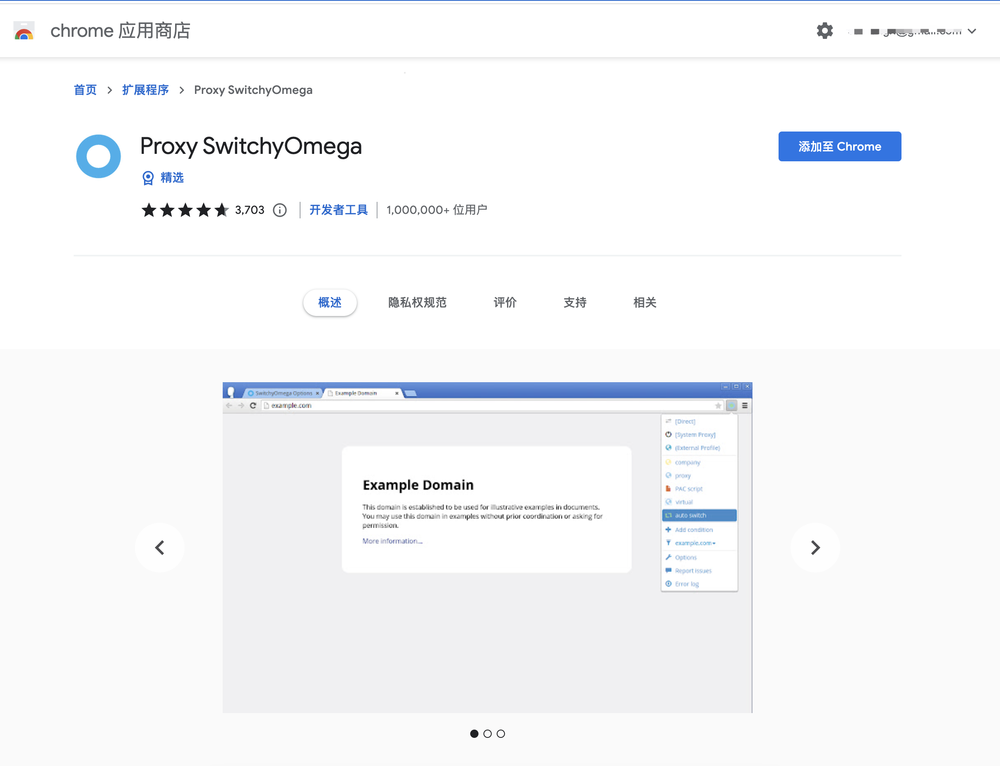
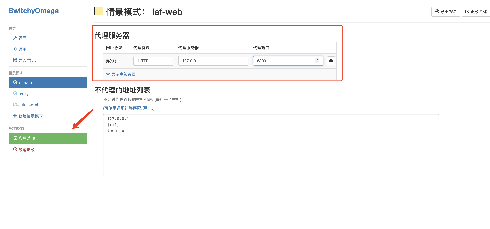
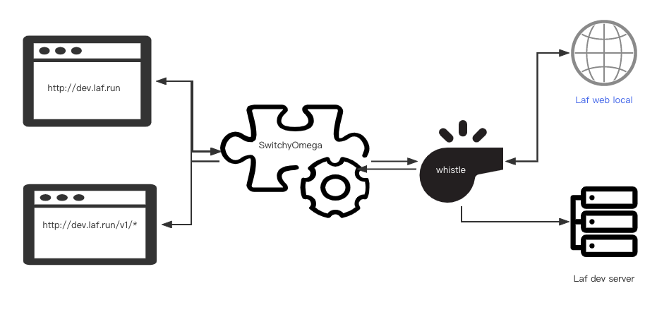
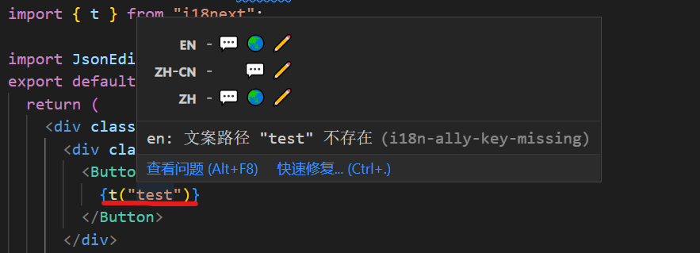

# Laf web 开发者快速上手文档

# 项目预览地址

[LaF 云开发](http://preview.laf.run/)

# Configure Local Develop Environment

## Create `.env.local` file
create .env.local file in web root directory, add following command:

```bash
VITE_SERVER_URL=http://dev.laf.run
```

## Install dependencies and Start

```bash
pnpm install
pnpm run dev
```
注：如在启动后看到如下提示
```bash
The following dependencies are imported but could not be resolved:

  @chakra-ui/anatomy (imported by /Users/xxx/workspace/laf/web/src/chakraTheme.ts)

Are they installed?
```
需要手动安装 `@chakra-ui/anatomy` package
```bash
pnpm i @chakra-ui/anatomy
```
## Solve CORS Problem

因为我们只启动前端项目，后端服务是直连的开发服务器 http://dev.laf.run, 所以会遇到跨域问题，此处提供三种解决方案:

### 1. Disable browser's web security mode (**Not Recommended**)
> Suppose you are using a Chrome browser

```bash
# Linux
google-chrome --disable-web-security
# Mac
open -a Google\ Chrome --args --disable-web-security
# Windows
cd WHERE_YOU_INSTALL_CHROME
chrome.exe --disable-web-security
```

### 2. `vite.config.ts`

`Vite` 是一套前端构建工具，可以显著提升开发体验，主要由一个开发服务器和一套构建指令组成。这里我们利用其提供的开发服务器来帮助我们解决代理问题。

```ts
export default defineConfig({
    // ...
  server: {
    port: 3001,
    host: "0.0.0.0",
    proxy: {
      "/v1": { // v1 means apis to server
        target: "http://preview.laf.run",
        changeOrigin: true,
      }
    }
  }
  // ...
})
```
上述配置的作用即是将 `key`: `/v1` 开头的请求代理至 `target`: `https://dev.laf.run` 上。详情可参考 [Vite: server.proxy](https://cn.vitejs.dev/config/server-options.html#server-proxy)

注：由于我们之前 `.env.local` 中配置了 `VITE_SERVER_URL`， 所以这里的转发规则是不生效的，需要我们在 `.env.local` 中做如下修改:

```bash
VITE_SERVER_URL=""
```

此时再运行 `pnpm run dev` 即可解决跨域问题。
此外，由于 `laf` 的登录认证是接入的 `casdoor`, 登录后的回跳地址是固定的，需要我们手动修改为 `localhost:3001`, 也即我们本地的服务器。修改完后回车，再进行登录即可跳回 `localhost:3001`


### 3. Use `whistle` proxy

`whistle` 是基于 Node 实现的跨平台 web 调试代理工具, 简单来说，可以将其理解一个连接客户端和远程服务器的“中转站”，当你向服务器发出请求后，代理服务器先获取用户的请求，再将服务请求转发至远程服务器，并将远程服务器反馈的结果再转交给客户端。详情可参考 [whistle 文档](http://wproxy.org/whistle/install.html)。

`whistle` 本质上是一个代理服务器，我们想在浏览器中解决`laf web` 开发遇到的跨域问题，还需要一个浏览器插件： [SwitchyOmega](https://chrome.google.com/webstore/detail/proxy-switchyomega/padekgcemlokbadohgkifijomclgjgif) 配合来完成功能。

- 安装 `whistle` 并启动
```bash
npm i whistle -g
w2 start
```
`whistle` 默认会启动在 `http://127.0.0.1:8899`

- 安装浏览器插件



- 添加一个名为 `laf-web` 的情景模式， 供后续使用


- 配置代理服务器为 `whistle`, 即 `http://127.0.0.1:8899`, 并将方不代理的地址列表清空。



- 配置 whistle 转发规则

在浏览器中输入 `http://127.0.0.1:8899` 打开 `Whistle` 控制台, 新建一条名为 `laf-web` 的规则，并配置如下，配置成功后双击，看到绿色的对号即启用成功。

```bash
http://dev.laf.run/ http://127.0.0.1:3001/ excludeFilter://http://preview.laf.run/v1/
```

该配置即，将 `http://dev.laf.run/` 转发到 `http://127.0.0.1:3001/`, 但是 `/v1/` 路径下的除外 (`/v1` 路径意味着向服务端的请求)


- 修改 `.env.local` 中的 `VITE_SERVER_URL` 为 `http://dev.laf.run`

```bash
VITE_SERVER_URL=http://dev.laf.run
```

- 运行 `pnpm run dev`

打开 `http://dev.laf.run`, 点击浏览器地址栏右侧插件图标，启用 `SwitchyOmega` 中我们提前配好的情景模式。


通过上述操作，我们利用 whistle 和 SwitchyOmega 提供的代理能力解决了 laf-web 本地开发遇到的跨域问题。

首先，我们请求 `http://dev.laf.run`, 因为开启了 `SwitchyOmega`, 所以请求首先会指向代理服务器 -> `whistle: 127.0.0.1:8899`。

其次, `whistle` 根据配置的转发规则将 `http://dev.laf.run` 的请求指向了 `http://127.0.0.1:3001`, 即我们本地启动的 `laf-web`。

下图简单展示 `whistle` 代理工作原理。


# 相关框架简介

## 基础框架: react

## 数据请求：react-query + axios

1. 链接：

[Overview | TanStack Query Docs](https://tanstack.com/query/v4/docs/react/overview)

1. 为什么使用react-query?

[refactor: react query best practice  by LeezQ · Pull Request #496 · labring/laf](https://github.com/labring/laf/pull/496#issue-1482332711)

1. 用法参考： web\src\pages\app\functions\service.ts

    在本项目中对于每个页面都会存在service.ts文件用于管理当前页面内的请求


## 状态管理：zustand + immer

1. 链接：

[Zustand](https://zustand-demo.pmnd.rs/)

1. 用法参考: web\src\pages\app\functions\store.ts

    项目的全局状态管理： web\src\pages\globalStore.ts

    每个页面的状态管理：存放在对应的store.ts中


## UI库：chakra

1. 链接：

[Installation](https://chakra-ui.com/getting-started)

1. 自定义样式要修改：web/src/chakraTheme.ts

## 样式: tailwind (主要)+ sass

1. 链接：

[Tailwind CSS - Rapidly build modern websites without ever leaving your HTML.](https://tailwindcss.com/)

1. 自定义样式要修改：web/tailwind.config.cjs

## 国际化:i18next

1. 链接：

[Introduction](https://www.i18next.com/)

1. 国际化文案: web/public/locales
2. 使用方法：

3.1 直接写t(”test”),鼠标hover上去后会出现如下提示框


3.2 点击zh-CN后面的编辑icon会出现如下输入框，输入后回车就完成了zh-CN文本的翻译


3.3 在所有编码结束后点击编辑器的翻译插件，可以看到EN和ZH有缺失的翻译文案，点击地球icon即可完成自动翻译


## ICON：react-icons + 自定义icon

1. 链接:

[React Icons](https://react-icons.github.io/react-icons/)

1. 自定义ICON使用@chakra-ui/icons

# 提PR流程

主要流程可以参考：

[三分钟学会参与开源，提交 pr | 左风的博客](https://zuofeng59556.github.io/my-blog/pages/quickStart/pr/)

需要注意的是 laf项目提交的commit格式如下:

```markdown
// () 后面有一个空格
新特性：commit -m "feat(web): this is new"
修复bug: commit -m "fix(web): fix bugs"
...
```