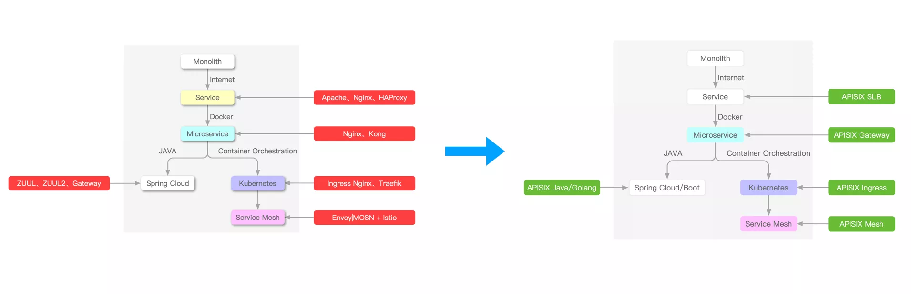

# 基本概念

## 节点

节点是一个构成一个集群的宿主机，一般在一个同一个网络中，互联无需 NAT。

master 节点就是带集群管理功能的 worker 节点，Worker 节点能干的事 master 都能干。只不过一般多节点集群不会让 master 跑 app。

## Pod

每个节点上有一个 kubelet 实例，用于管理这个节点上的所有 Pod。

Master 上的 API server、etcd 等组件本身也是 static Pod。在 kubelet 眼中，API server 并无特别，与普通跑 app 的 Pod 没有区别，正如在 Linux 内核眼里，systemd 和普通进程并没有区别。可以说整个集群中，只有 kubelet 自己不是跑在 Pod 里。

### 为什么需要 Pod 而不能只用容器。

因为容器是单进程模型，你在容器外只能与容器内的根进程打交道。

### Replicaset

一个 ReplicaSet 维护一个 Pod 的一个版本的副本数。

### Deployment

Deployment 只负责管理不同版本的 ReplicaSet。

例如，在更新 Deployment 中 Pod 版本时，Deployment 会创建一个新的 ReplicaSet，并不断调整两个 ReplicaSet 的目标副本数，知道旧 ReplicaSet 的目标副本数调至 0。

## 虚拟网络

在集群虚拟网络层，一个 Pod 是一个主机，有自己的 IP，称为 clusterIP。Pod 内的容器就是这个主机上的进程，通过 localhost 通信。

### 网络插件

Linux veth 只能实现单机虚拟网络，而 flannel、calico 等网络插件用于实现跨宿主机的虚拟网络。

### Service

Service 是给一组 Pod 一个统一的主机名和 IP，一般一个 Deployment 设置一个 Service。Pod 可以用 `<hostname>.<namespace>` 访问其他命名空间的 Service。

普通的 Service 是一个虚拟网络 TCP 层的概念。

#### kube-proxy

每个节点上都运行了一个 kube-proxy，为本节点上的 Pod 们提供 Service clusterIP 到 Service 后端 Pod clusterIP 的转换。

一种常见的实现方式是由 kube-proxy 给集群中所有 Pod 的虚拟网络层网卡设置 iptables，只要 dest 是 Service 的 cluster IP，就负载均衡地转发到 Service 后端的某个 Pod 的 clusterIP 上。因此并不存在一个真实的 Pod 拥有这个 clusterIP。

#### Node port

node port 功能将一个节点宿主机上某个端口转发到 Pod 的某个端口上，构成了虚拟网络与宿主机网络的桥梁。可以理解为宿主机 network namespace 和 Pod 的 network namespace 用 veth pair 连起来。

#### Load balancer

load balancer 功能用于将 Service 暴露到公网。可以理解为在公网网关路由器上设置了 iptables，将公网流量转发到 Service 后端节点所在节点们的 node port 上。因此 load balancer 是一个宿主机网络 TCP 层的功能。

### Ingress

Ingress 是一个 HTTP 层路由器，用于将公网网关收到的 HTTP 请求依据 `Host` header 和 path 转发给不同 Service。

监听 Ingress 配置变化并实现配置的 controller 称为 Ingress controller。Ingress controller 可以有不同实现，比如 NGINX Ingress Controller、APISIX Ingress Controller。

#### Nginx

Nginx 是一个 web 服务器，也可作为负载均衡。

#### APISIX

APISIX 包含 Nginx，把 Nginx 的 web 服务的后端进程里的逻辑通过 hook 的方式部署在 Nginx 内部，充分利用 Nginx 的非阻塞 I/O 模型，大幅提高性能。

APISIX 支持路由表配置热加载，而 Nginx 不支持。

APISIX 本身支持容备。

[有了 NGINX 和 Kong，为什么还需要 Apache APISIX？——韩飞](https://apisix.apache.org/zh/blog/2022/07/30/why-we-need-apache-apisix/)

# Telepresence

Telepresence 用于将开发机接入集群，让开发机以为自己变成了集群中的一个 Pod。

开发机接入集群后，还可以拦截其他 Pod 的收到的流量转发到开发机。
