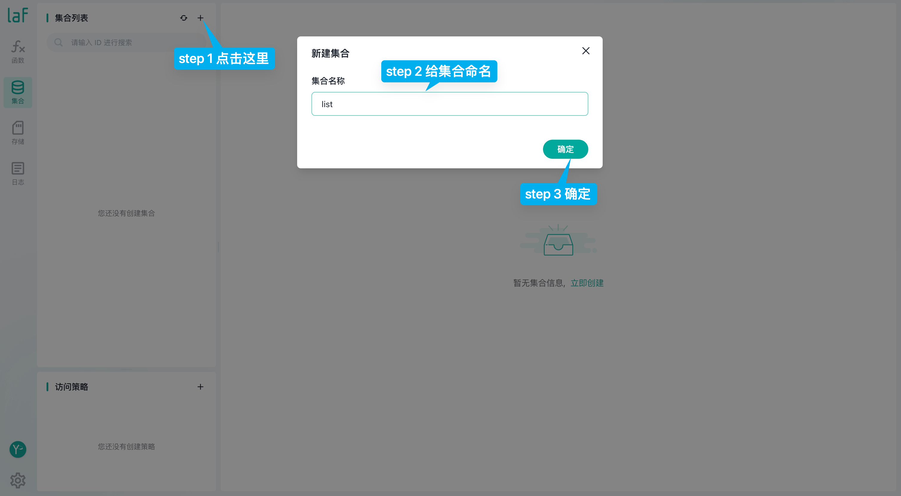

# {{ $frontmatter.title }}

We will quickly experience the `laf` cloud development by developing a simple "Todo" feature on [laf.run](https://laf.run).


## Preparation

1. You need to register an account on [laf.run](https://laf.run).
2. Log in to [laf.run](https://laf.run), click the `New` button to create an empty application.
3. After the application starts successfully, click the "Development" button on the right to enter the "Development Console" of the application. Next, we will develop the first `laf` application's feature in the "Development Console".

## Write Cloud Functions

First, you need to create a cloud function.


Then write the following code in the `get-list` cloud function, and don't forget to find the word "Publish" in the upper right corner and click it after finishing writing.

```typescript
import cloud from '@lafjs/cloud'

const db = cloud.database()
export async function main(ctx: FunctionContext) {
  // Query data from the list collection
  const res = await db.collection('list').get()
  // Return to the front end
  return res
}
```

Following the same way, we create the `add-todo`, `del-todo`, `update-todo` functions, and write the code for each of them.

`add-todo`

```typescript
import cloud from '@lafjs/cloud'

const db = cloud.database()
export async function main(ctx: FunctionContext) {
  // ctx.body is the parameter passed in from the front end
  const data = ctx.body
  const res = await db.collection('list').add(data)

  return res
}
```

`del-todo`

```typescript
import cloud from '@lafjs/cloud'

const db = cloud.database()
export async function main(ctx: FunctionContext) {

  const { id } = ctx.body
  // Delete data based on id
  const res = db.collection("list").where({ _id: id }).remove()

  return res
}
```

`update-todo`

```typescript
import cloud from '@lafjs/cloud'

const db = cloud.database()
export async function main(ctx: FunctionContext) {

  const { id, data } = ctx.body
  // _id is a unique primary key and cannot be modified, so we delete it here
  delete data._id
  // Modify data based on id
  const res = await db.collection('list').where({ _id: id }).update(data)

  return res
}

```

:::tip
Reminder again, every modified cloud function needs to be "Published" to take effect!
:::

## Create Collections

Here, the collection corresponds to the table in a traditional database and is used to store data.



## Front-end

In the front-end, we use a Vue project as an example, but the operations are the same for React/Angular/WeChat mini programs.
First, you need to install `laf-client-sdk` in your front-end project.

```shell
npm install laf-client-sdk
```

Do you remember the page where we just created the project? We need to go back there and find the `<APPID>` that we need to use.


Import and create a cloud object, where you need to replace `<APPID>` with your own.

```js
import { Cloud } from "laf-client-sdk"; // Import

// Create cloud object
const cloud = new Cloud({
  baseUrl: "https://<AppID>.laf.run", // Replace <AppID> with your AppID here
  getAccessToken: () => '', // Set it as empty for now
});
```

Then, call our cloud functions wherever needed in the front-end.

```js
async function getList() {
  // Call the get-list cloud function without any parameters
  const res = await cloud.invoke("get-list");
  list.value = res.data;
}

async function submit() {
  if (!newTodo.value) return;

  const obj = {
    name: newTodo.value,
    complete: false,
  };
  // Call the add-todo cloud function with the parameter obj
  await cloud.invoke("add-todo", obj);
  newTodo.value = "";

  getList();
}


async function complete(index, id) {
  list.value[index].complete = !list.value[index].complete;
  // Call the update-todo cloud function with parameters
  await cloud.invoke("update-todo", {
    id,
    data: list.value[index],
  });
}


async function del(id) {
  // Call the del-todo cloud function with the parameter
  await cloud.invoke("del-todo", { id });
  getList();
}
```

With these steps, we have completed the core functionalities of the project. You can also download the code template to try it out.

:::tip
Remember to modify `<AppID>` in src/App.vue.
:::

Template link: <https://github.com/labring/laf-examples/tree/main/laf-todo-demo>