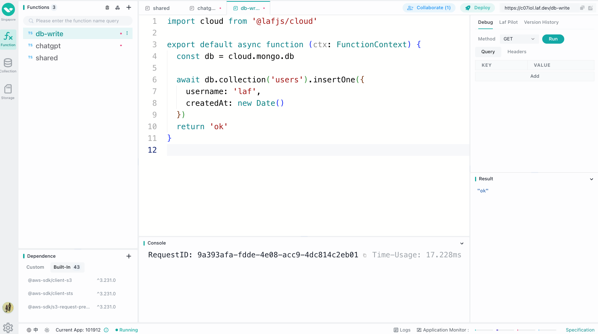

# Introduction

## 👀 What is `laf`

`laf` is an open-source cloud development platform that offers ready-to-use application resources such as cloud functions, cloud databases, and cloud storage. It allows developers to focus on business development without the need to tinker with servers, enabling them to quickly unleash their creativity.

## 🖥 Online experience

🎉 [laf.dev](https://laf.dev) Free experience `laf` cloud development.

## 🎉 Features of `laf`

- Cloud Functions
- Cloud Database
- Cloud Storage
- WebIDE, Write code like writing a blog
- Website Hosting
- WebSocket support

## 👨‍💻 Who uses `laf`?

1. Front-end developers + `laf` = Full-stack developers, transforming front-end developers into true full-stack developers.

   - `laf` provides [laf-client-sdk](https://github.com/labring/laf/tree/main/packages/client-sdk) for front-end developers, suitable for any JavaScript runtime environment.
   - `laf` allows front-end and back-end code to be developed using JavaScript/TypeScript, eliminating the barrier between them and enabling a quick learning curve.
   - `laf` offers static website hosting, allowing direct deployment of front-end built web pages without the need for server configuration, nginx, domains, etc.
   - `laf` will provide SDKs for various client platforms (Flutter/Android/iOS, etc.) in the future, offering backend development services and a consistent development experience for all client developers.

2. Back-end developers can free themselves from trivial tasks and focus on the core business, enhancing development efficiency.

   - `laf` saves effort on server maintenance, multi-environment deployment, and management.
   - `laf` eliminates the need for configuration and debugging of nginx.
   - `laf` eliminates the repetitive work of manually deploying databases and addressing security concerns for each project.
   - `laf` eliminates the tedious iterative experience of "making changes and taking half a day to publish."
   - `laf` allows you to view function execution logs anytime, anywhere on the web without the need to connect to servers or spend time searching.
   - `laf` enables you to "write a function like writing a blog," making it easy to publish and invoke functions effortlessly.

3. Cloud development users, if you are a user of other cloud development platforms, `laf` not only provides a more powerful and fast development experience but also prevents vendor lock-in.

   - You can deliver source code to clients and privately deploy a `laf` + your cloud development application. Closed-source cloud development services cannot deliver independently runnable source code.
   - You can deploy your own product to your servers at any time according to future needs, as `laf` is open-source and free.
   - You can even modify and customize your own cloud development platform, as `laf` is open-source and highly extensible.

4. Independent developers and startup teams can save costs, start quickly, and focus on their business.

   - Reduce the project development process, start quickly, and shorten the product validation cycle.
   - Greatly improve iteration speed, adapt to changes at any time, and release updates quickly.
   - Focus on the core business of the product, quickly launch Minimum Viable Products (MVP), and validate the product and market rapidly.
   - One person + `laf` = a team.

> life is short, you need laf:)

## 🏘️ Community Groups

- [Discord](https://discord.gg/uWZqAwwdvy)
- [Twitter](https://twitter.com/laf_dev)

## 🌟 Star History

