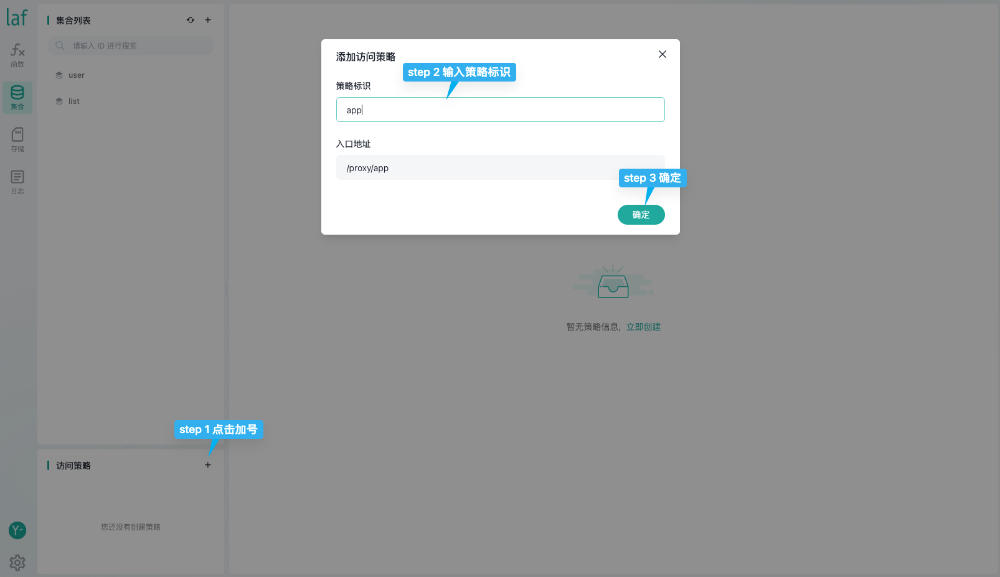
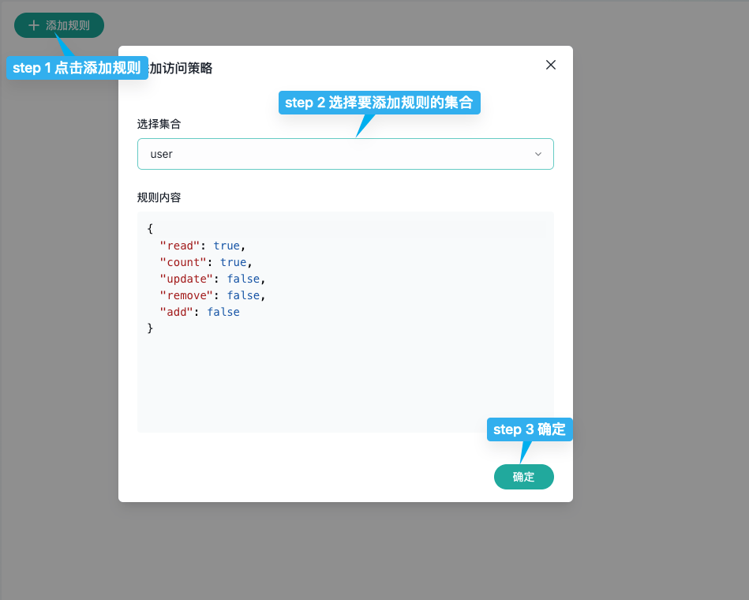
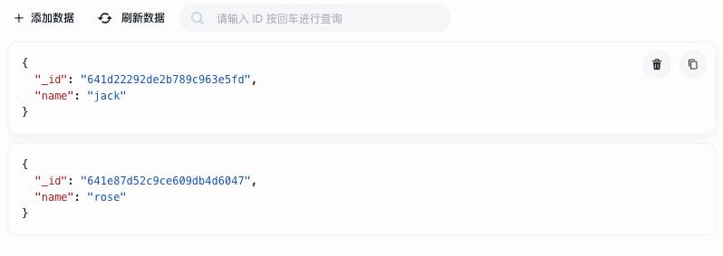

# {{ $frontmatter.title }}

前端可使用 [laf-client-sdk](https://github.com/labring/laf/tree/main/packages/client-sdk) “直连”数据库，无需与服务端对接口。

访问策略用来对客户端对数据库的操作进行安全控制，一个访问策略由多个集合的访问规则组成，每个集合可配置读写操作权限的访问规则。

开发者可以为应用创建多个访问策略，以供不同的客户端使用。

通常应用可创建两个访问策略：

- `app` 用于用户端客户端的访问策略，一般可以是 App、小程序、H5 等
- `admin` 用于应用的后台管理的访问策略

## 创建策略
首先我们切换到集合页面，按照下面步骤为 user 集合添加一个访问策略。 
:::tip
如果你还没有 user 集合就先创建一个。
::: 





做完这两步之后，我们就成功的创建了一个访问策略，并且把策略放在了 user 集合上。   
这里我们解释一下规则内容：  
```js
{
  "read": true, // 查询权限
  "count": true, // 计数权限
  "update": false, // 修改权限
  "remove": false, // 删除权限
  "add": false // 新增权限
}
```
我们把值设为 true 则代表允许，false 则为不允许，按照我们刚刚默认的规则，前端可以直接对我们的集合进行`查询`和`计数`操作，而增 删 改，是不允许的。  
这里还有另外一个值得留意的地方，就是"入口地址" 刚刚我们设置的策略名称为 app ，那么入口地址就是 /proxy/app ，接下来演示一下如何使用。

## 前端 “直连” 
在演示之前我们先往 user 集合中加一点数据。



我们来到前端项目，这里使用 Vue 项目来演示，其他项目同理。   
### 首先安装 SDK ：  
```bash
npm i laf-client-sdk
```

### 然后创建 cloud 对像
这里注意了，我们多填写一个参数 dbProxyUrl ，那么它的值就是我们刚刚强调的入口地址“/proxy/app”
```js
import { Cloud } from "laf-client-sdk";

const cloud = new Cloud({
  baseUrl: "https:/<APP_ID>.laf.dev",   // <APP_ID> 在首页应用列表获取
  getAccessToken: () => "",    // 这里不需要授权，先填空
  dbProxyUrl: "/proxy/app", // 这里就填写我们刚刚强调的“入口地址”
})
```
创建完 cloud 对像之后我们尝试一下在前端直接发起查询。
```js
async function get() {
  const res = await cloud.database().collection("user").get();
  console.log(res);
//   {
//   "data": [
//       {
//           "_id": "641d22292de2b789c963e5fd",
//           "name": "jack"
//       },
//       {
//           "_id": "641e87d52c9ce609db4d6047",
//           "name": "rose"
//       }
//   ],
//   "ok": true
// }
}
```
现在我们来试试 count。

```js
async function get() {
  const res = await cloud.database().collection("user").count();
  console.log(res);
  // {
  //   "total": 2,
  //   "ok": true
  // }
}
```
可以看到，简单的查询计数我们已经不需要写云函数，直接在前端即可实现，如果你想体验 `增删改` 可以修改对应策略的权限为 true ，但这是一个很危险的行为。

## 实践建议

初识访问规则，可能会觉其烦琐难以掌握，而且容易写错，或是对其安全性不自信、自知，所以根据我们在大量项目中的实践经验，给出一些建议：

- 最小权限原则，即只给客户端必要的访问权限，只开放给客户端必要的集合；

  - 即便只开放 `read` 权限，也可能节省 30%～ 50% 的后端接口；
  - 再配合一些基本的 `condition` 判断，可有效减少 70%～ 90% 的后端接口；

- 事务性的数据操作、复杂的表单提交，建议使用云函数实现：

  - 云函数与客户端 SDK 接口一致，简单、轻量、快捷，无二次学习成本，调试更容易、无部署负担
  - 云函数中访问数据库，无需编写访问规则，因为云函数是服务端执行的可信代码

- 访问规则虽然也可以完成很多复杂的验证，但是除非你非常熟练的掌握了它，否则建议用云函数来实现这部分逻辑