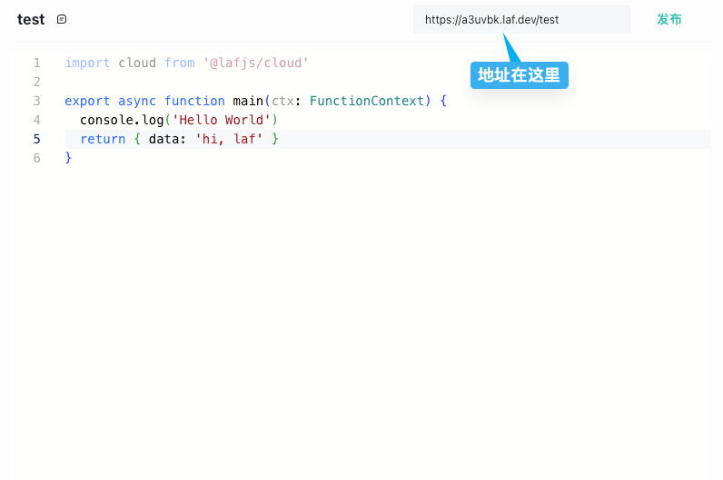

# HTTP 调用

云函数每个云函数都提供了 API 地址，理论上我们可以在任何能发起 http 请求的地方调用云函数。



下面是用前端使用 `axios` 请求云函数的简单示例。

```ts
const { data } = await axios({
  url: "<FunctionURL>",
  method: "get",
});

console.log(data);
```
