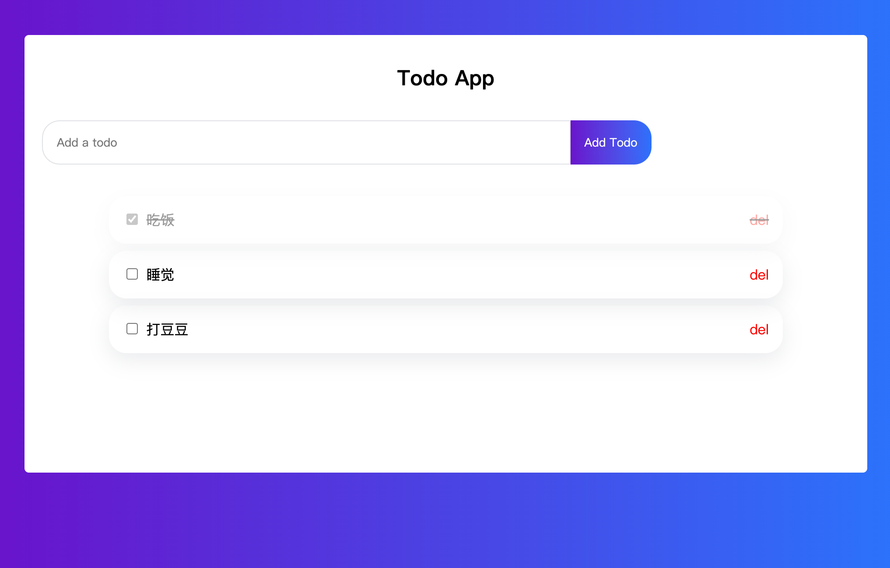
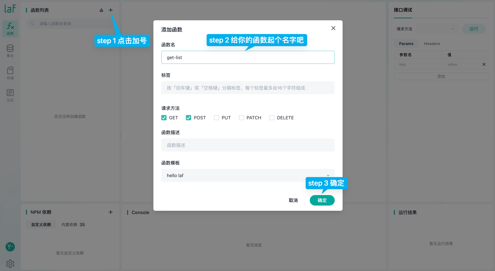
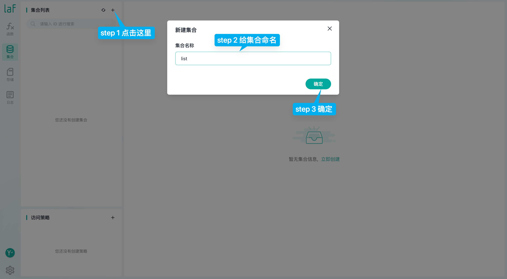
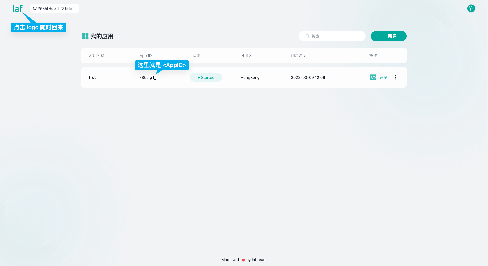

# {{ $frontmatter.title }}

我们将在 [laf.run](https://laf.run) 上，通过开发一个简单的「Todo」的功能，快速体验 `laf` 云开发。 


## 准备工作

1. 你需要在 [laf.run](https://laf.run) 上注册一个账户。
2. 登录到 [laf.run](https://laf.run)，点击 `新建` 按钮，创建一个空应用。
3. 待应用成功启动后，点击右侧 「开发」 按钮，进入应用的「开发控制台」，接下来，我们将在「开发控制台」 进行第一个 `laf` 应用的功能开发。

## 编写云函数
首先需要创建一个云函数。


然后在`get-list`云函数中写上以下代码,写完以后记得在右上角找到`发布`两个字，点一下发布。
```ts
import cloud from '@lafjs/cloud'

const db = cloud.database()
export async function main(ctx: FunctionContext) {
  // 从 list 集合中查询数据
  const res = await db.collection('list').get()
  // 返回给前端
  return res
}
``` 
按照刚刚的方式我们再创建 `add-todo` `del-todo` `update-todo`，三个云函数，并分别写入代码。   
`add-todo`
```ts
import cloud from '@lafjs/cloud'

const db = cloud.database()
export async function main(ctx: FunctionContext) {
  // ctx.body 是前端传入的参数
  const data = ctx.body
  const res = await db.collection('list').add(data)

  return res
}
```

`del-todo`
```ts
import cloud from '@lafjs/cloud'

const db = cloud.database()
export async function main(ctx: FunctionContext) {

  const { id } = ctx.body
  // 根据 id 删除数据
  const res = db.collection("list").where({ _id: id }).remove()

  return res
}
```

`update-todo`
```ts
import cloud from '@lafjs/cloud'

const db = cloud.database()
export async function main(ctx: FunctionContext) {

  const { id, data } = ctx.body
  // _id 是唯一主键，不能修改，所以我们这里删掉
  delete data._id
  // 根据 id 来修改数据
  const res = await db.collection('list').where({ _id: id }).update(data)

  return res
}

```
:::tip
再次提醒，更改过的每一个云函数都需要`发布`才能生效哦！
:::

## 创建集合
这里的集合，对应着传统数据库的表，用来存储数据。


## 前端
前端这里我们用的是 Vue 项目来演示，React/Angular/小程序，操作都是相同的。      
首先需要在前端项目中安装 `laf-client-sdk`。
```
npm install laf-client-sdk
```  
还记得刚创建完项目的页面吗，我们需要回到那里找到我们需要用到的`<APPID>`。


引入并创建 cloud 对象，这里需要注意的是`<APPID>`需要换成自己的。
```js
import { Cloud } from "laf-client-sdk"; // 引入

// 创建cloud对象
const cloud = new Cloud({
  baseUrl: "https://<AppID>.laf.run", // 这里的 <AppID> 需要换成自己的 AppID
  getAccessToken: () => '', // 这里先为空
});
```

然后我们在前端需要的地方调用我们的云函数。
```js
async function getList() {
  // 调用 get-list 云函数不传参
  const res = await cloud.invoke("get-list");
  list.value = res.data;
}


async function submit() {
  if (!newTodo.value) return;

  const obj = {
    name: newTodo.value,
    complete: false,
  };
  // 调用 add-todo 传入参数 obj
  await cloud.invoke("add-todo", obj);
  newTodo.value = "";

  getList();
}


async function complete(index, id) {
  list.value[index].complete = !list.value[index].complete;
  // 调用 update-todo 传入参数
  await cloud.invoke("update-todo", {
    id,
    data: list.value[index],
  });
}


async function del(id) {
  // 调用 del-todo 传入参数
  await cloud.invoke("del-todo", { id });
  getList();
}
```
到这里我们已经完成了项目的核心功能，你也可以下载代码模板来体验。   
模板地址：https://github.com/labring/laf-examples/tree/main/laf-todo-demo
:::tip
需要在 src/App.vue 中修改 `<AppID>`
:::
