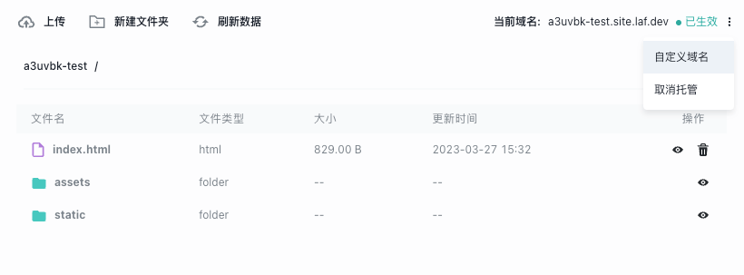

# {{ $frontmatter.title }}

## 简介

静态托管是基于云存储提供的网站托管服务。

可通过「开发控制台」或 `laf-cli` 将网页静态文件上传到云存储的 bucket 中，

静态托管会为你的网站自动提一个独立的域名，也可以绑定自定义域名。

## 如何使用？

- 将开发好的项目打包。
- 创建一个 bucket ，将打包后的项目丢进去。
- 点击开托管，上线成功！

## 演示
### 创建 bucket

### 上传文件，开启网站托管

### 上线成功
这样我们就上线成功了，点击链接即可访问，当然我们也可以点击自定义域名来绑定自己的域名。

