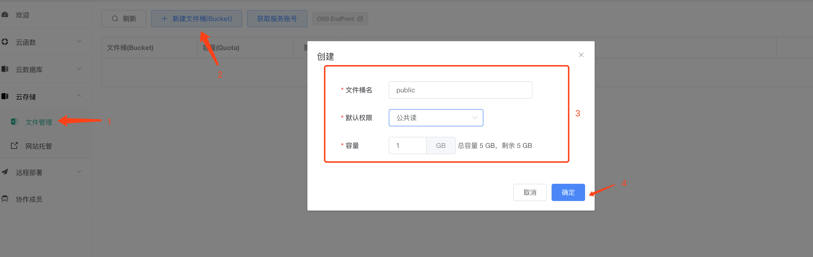
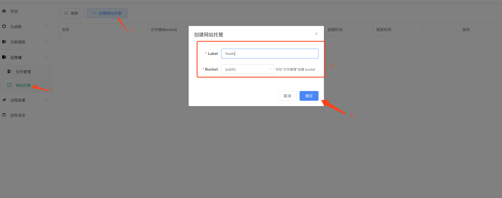
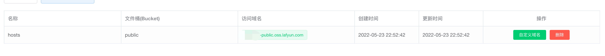

### 托管静态网站

1. 创建一个 bucket 用于存储静态网站文件
2. 上传静态网站文件到 bucket
3. 创建一个网站托管配置

### 创建一个存储 bucket

1. 在「开发控制台」选择「文件管理」
2. 点击「新建文件桶」按钮，创建一个 bucket, 并且设置 bucket 的权限必须为「公共读」，确认即可
3. 点击「获取服务账号」按钮，先将 `AccessKey` 和 `SecretKey` 保存下来，下一步上传文件时使用



### 上传网页静态文件

1. 使用 laf-cli 上传静态文件

```bash
# 安装 laf-cli 命令行工具
npm install -g laf-cli
```

2. 上传静态文件

- `--access-key` 替换为你上一步获取的 AccessKey
- `--access-secret` 替换为你上一步获取的 SecretKey
- `--bucket-name` 参数为目标 bucket 全名，如 `qya2cx-public`
- `./dist` 是本地静态文件所在目录，可以修改为你的项目中的静态文件目录。

```bash
laf-cli sync \
  --access-key YOUR_ACCESS_KEY \
  --access-secret YOUR_SECRET_KEY \
  --bucket-name YOUR_APPID-public \
  ./dist
```

### 创建网站托管

1. 在「开发控制台」选择「网站托管」
2. 点击「创建网站托管」按钮，选择你的 bucket，确认即可



3. 列表显示默认访问域名，也可以绑定自定义域名



### 注意事项

- 域名根路径对应 bucket 的根路径
