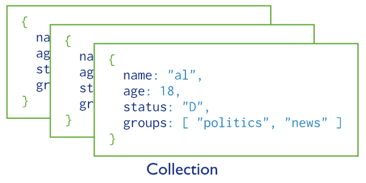

# 云数据库介绍

Laf 云数据库提供了开箱即用的数据库服务，无需自行搭建和配置数据库，即可快速使用数据库服务。

::: info 本节目录
[[toc]]
:::

## 基本概念

### 文档（Document）

文档是云数据库中数据的基本单元，类似于关系型数据库中的行。文档是一个键值对的有序集合，文档中的键值对是有序的，文档中的键是字符串，值可以是各种复杂的数据类型。

```json
{
    "_id": "5f7b6b6b6b6b6b6b6b6b6b6b",
    "name": "张三",
    "age": 18,
    "hobbies": ["篮球", "足球", "游泳"],
    "address": {
        "province": "广东省",
        "city": "珠海市",
        "district": "香洲区"
    }
}
```
::: info
在云数据库中，每个文档都有一个 `_id` 字段，用于唯一标识一个文档。如果插入文档时没有指定 `_id` 字段，会自动生成一个唯一的 `_id` 字段。
:::

### 集合（Collection）

集合是一组文档的集合，类似于关系型数据库中的表。集合中的文档可以是不同的结构，但是通常情况下，集合中的文档都有着相同的结构。


### 数据库（Database）

数据库是一组集合的集合，类似于关系型数据库中的数据库。


## 下一步
::: tip
- [快速开始](./quick-start.md)
- [插入文档](./insert.md)
- [查询文档](./find.md)
- [更新文档](./update.md)
- [删除文档](./delete.md)

> _Laf 云数据库底层是 [MongoDB](https://www.mongodb.com/)，可以直接使用原生 MongoDB 的语法进行操作。_
:::