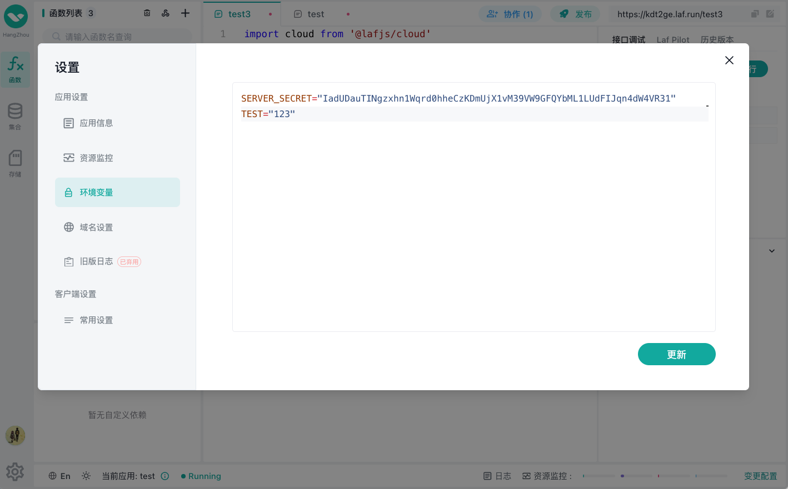

# 环境变量

在 laf「开发控制台」，点击左下角的「设置」按钮，可打开「应用设置」面板，在「环境变量」可修改/添加环境变量。




## 访问环境变量

可通过 `process.env` 访问应用环境变量。

```typescript
export default async function (ctx: FunctionContext) {
  const appid = process.env.APPID
  console.log(appid)
}
```

## 内置的环境变量

::: warning 提示
通常不需要手动修改应用的内置环境变量，可能会对应用产生不可预期的影响，除非你很清楚其用法用途。
:::

### `APPID`

`process.env.APPID` 可获取当前应用的 `appid`，请勿修改此项。

### `NPM_INSTALL_FLAGS`

`process.env.NPM_INSTALL_FLAGS` 可用于配置应用安装依赖时的额外参数，默认为空。

如果你需要指定应用执行 `npm install` 指令的镜像源，可添加此环境变量覆盖默认配置，如：

```sh
NPM_INSTALL_FLAGS="--registry=https://registry.npmjs.org"
```

::: tip
在 [laf.run](https://laf.run) 公有云上，为了加速中国大陆地区的应用初始化速度，使用了加速镜像，该值默认为 `--registry=https://registry.npmmirror.com --canvas_binary_host_mirror=https://npmmirror.com/mirrors/canvas --sharp_binary_host=https://npmmirror.com/mirrors/sharp --sharp_libvips_binary_host=https://npm.taobao.org/mirrors/sharp-libvips`
:::


### `SERVER_SECRET`

`process.env.SERVER_SECRET` 是应用运行时默认的服务端密钥，默认用于内置的 JWT 令牌的生成和验签，通常不需要修改此项。

**⚠️ 此项环境变量不可为空，不可被删除。**

> 相关内容 [云函数认证](./auth.md)。

### `DB_URI`

`process.env.DB_URI` 用于获取云数据库的连接地址，请勿修改此项。

### `LOG_LEVEL`

`process.env.LOG_LEVEL` 用于控制日志输出的级别，默认值为 `debug`，可选值有：
- `debug` 输出所有日志。
- `info`  输出除 `console.debug()` 以外的所有日志。
- `warn`  仅输出 `console.warn()` 和 `console.error()`的日志。
- `error` 仅输出 `console.error()` 日志。


### `LOG_DEPTH`

`process.env.LOG_DEPTH` 用于控制打印 Javascript 对象的嵌套深度，默认值为 `1`，最大可用值为 `5`。


### `REQUEST_LIMIT_SIZE`

`process.env.REQUEST_LIMIT_SIZE` 用于配置 HTTP 请求体大小的上限，默认值为 `10mb`，开发者可根据业务需要调整此值。


### `OSS_EXTERNAL_ENDPOINT` 

`process.env.OSS_EXTERNAL_ENDPOINT` 用于获取云存储的外网访问入口地址，在公有云中其值为 `https://oss.laf.run`，请勿修改此项。

### `OSS_INTERNAL_ENDPOINT`

`process.env.OSS_INTERNAL_ENDPOINT` 用于获取云存储的内网访问入口地址，请勿修改此项。

### `OSS_REGION`

`process.env.OSS_REGION` 用于获取云存储的区域信息，请勿修改此项。

### `OSS_ACCESS_KEY`

`process.env.OSS_ACCESS_KEY` 用于获取云存储的用户名，请勿修改此项。

### `OSS_ACCESS_SECRET`

`process.env.OSS_ACCESS_SECRET` 用于获取云存储的密码，请勿修改此项。

### `NODE_VERSION`

`process.env.NODE_VERSION` 用于获取应用运行时的 `Node.js` 版本。

### `NODE_MODULES_PUSH_URL`

`process.env.NODE_MODULES_PUSH_URL` 用于配置 `node_modules.tar` 缓存文件的下载地址，通常不需要修改。

默认应用的 `node_modules` 文件会缓存在应用自身的 `cloud-bin` 文件桶中，此环境变量的值为该文件桶的访问地址。

### `NODE_MODULES_PULL_URL`

`process.env.NODE_MODULES_PULL_URL` 用于配置 `node_modules.tar` 缓存文件的上传地址，通常不需要修改。

默认应用的 `node_modules` 文件会缓存到应用自身的 `cloud-bin` 文件桶中，此环境变量的值为该文件桶的上传地址。


### `RESTART_AT`

`process.env.RESTART_AT` 用于获取应用上一次重启的时间戳，其值形式如： `1703158202968`。


## 下一步
::: tip
- [HTTP 请求](./request.md)
- [HTTP 响应](./response.md)
- [HTTP 认证](./auth.md)
- [处理文件上传](./files.md)
- [发起网络请求](./fetch.md)
- [云数据库](../cloud-database/index.md)
- [云存储](../cloud-storage/index.md)
- [函数引用](./import.md)
- [依赖管理](./deps.md)
:::
