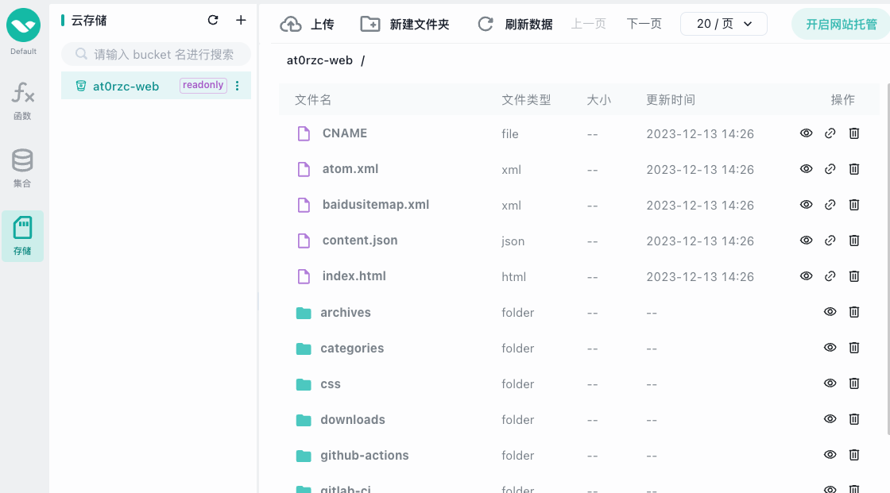
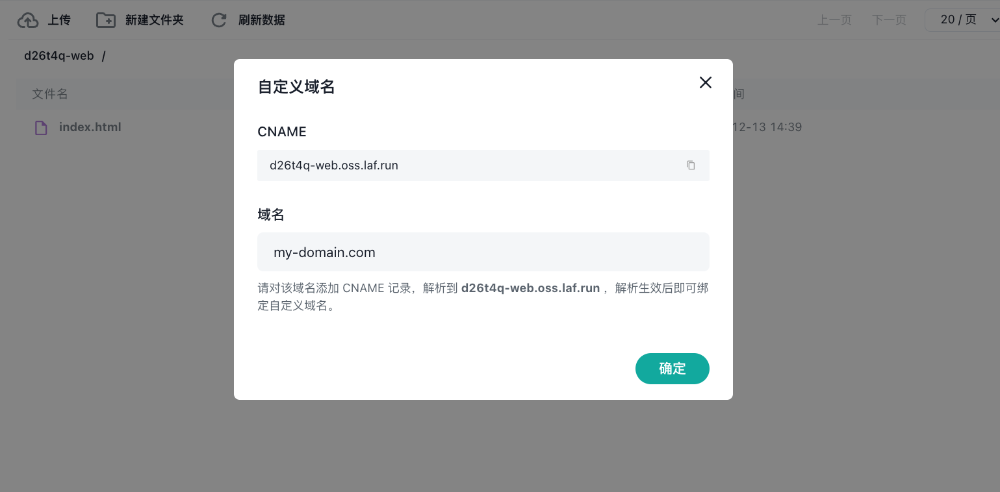

# 网站托管

在 laf 云存储中，可以选择一个存储桶开启网站托管服务。

网站托管会为你的网站自动提供一个独立的域名，也可以绑定自定义域名。

在存储桶中上传一个 `index.html` 的文件，作为默认首页。

## 开启网站托管

1. 创建一个存储桶，并设置其权限策略为 `readonly`,只有此权限的存储桶才能开启网站托管。
2. 将你的网站文件上传到该存储桶即可。
3. 在 `laf 控制台` 云存储页面，点击右上角「开启网站托管」，即可通过生成的地址访问你的网站。

## 绑定自定义域名

网站托管支持绑定自己的域名，并会自动为其生成 HTTPS 证书，支持 `https` 和 `http` 访问。

按页面上操作提示，完成域名的 `CNAME` 解析，等待解析生效后，可继续绑定操作。

::: tip 提示
- 域名解析生效时间：1～10分钟不等，待解析生效后才可继续绑定操作。
- 绑定自己的域名后，laf 将会自动为您的域名配置 `SSL` 证书，这个过程可能会有 1～2 分钟，之后即可通过 `https` 进行访问
:::

## 更多

[用 GitHub Action 自动构建前端并发布到网站托管](/zh/examples/website-hosting-ci-cd.md)