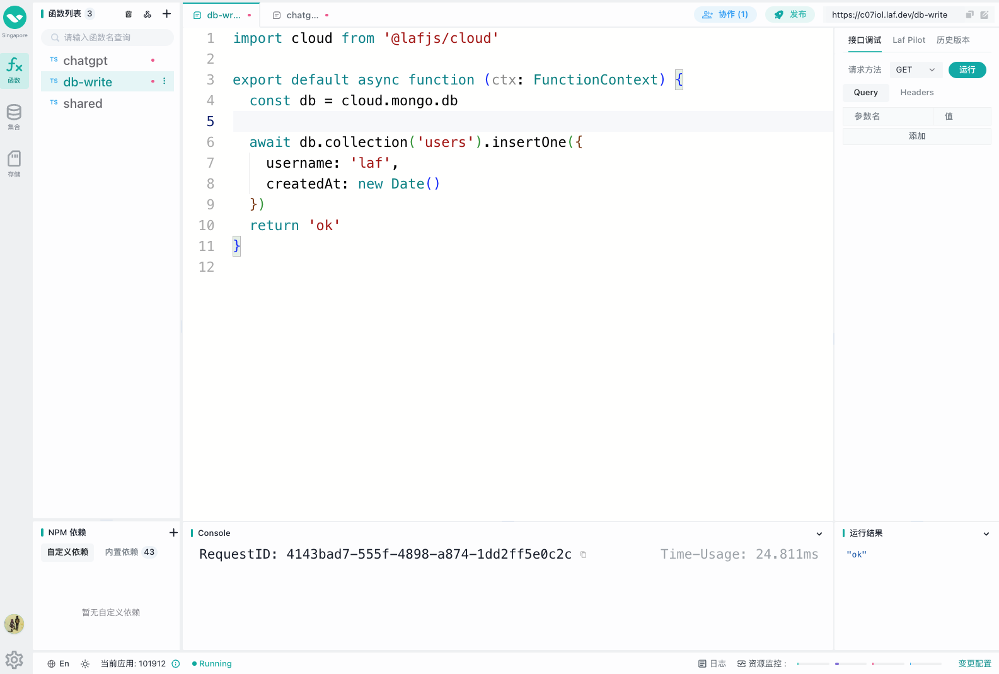

# laf 概览

## 👀 `laf` 是什么

`laf` 是开源的云开发平台，提供云函数、云数据库、云存储等开箱即用的应用资源。

让开发者专注于业务开发，无需折腾服务器，快速释放创意。

## 🖥 在线体验

🎉 [laf.run](https://laf.run) （国内版） 
🎉 [laf.dev](https://laf.dev) （海外版）

## 🎉 `laf` 有什么

- 云函数
- 云数据库
- 云存储
- 网站托管
- WebSocket 支持
- WebIDE，像写博客一样写代码

## 👨‍💻 谁适合使用 `laf` ?

1. 前端开发者 + `laf` = 全栈开发者，前端秒变全栈

   - `laf` 云函数使用 js/ts 开发，前后端代码无隔裂，无门槛快速上手
   - `laf` 提供了静态网站托管，可将前端构建的网页直接同步部署上来，无需再配置服务器、nginx、域名等

2. 后端开发者，可以从琐事中解放出来，专注于业务本身，提升开发效率

   - 节约服务器运维、多环境部署和多应用管理的成本
   - 告别域名、证书、调试 nginx 等配置
   - 不必手动部署数据库、安全防护等重复工作
   - 告别「修改一次、发布半天」的重复繁琐的迭代体验
   - 「像写博客一样写一个函数」，招之即来，挥之即去，随手发布！

3. 不被云厂商锁定

   - 可以为客户提供源码交付，为客户私有部署一套 `laf` ，而使用闭源的云开发服务，无法交付可独立运行的源码
   - 可以根据未来的需要，随时将迁移到自己的服务器上，`laf` 是开源免费的
   - 可以修改、订制自己的云开发平台，`laf` 是开源的、高度可扩展的

4. 独立开发者、创业团队，节约成本，快速开始，专注业务
   - 减少启动项目开发的流程，快速启动，缩短产品验证周期
   - 极大程度提高迭代速度，随时应对变化，随时发布
   - 专注于产品业务本身，快速推出最小可用产品 (MVP)，快速进行产品、市场验证
   - 一个人 + `laf` = 团队

> life is short, you need laf:)

## 🎉 私有化部署？

> 快速部署：[Sealos](https://sealos.io) 提供开箱即用的域名、证书、网关、数据库、监控、备份等，无需配置，一键部署。

## 🏘️ 社群

- [论坛](https://forum.laf.run/)
- [微信群](https://cdn.jsdelivr.net/gh/yangchuansheng/imghosting3@main/uPic/2022-04-22-14-21-MRJH9o.png)
- QQ 群：`603059673`
- 官方公众号：`laf-dev`

## 下一步

::: tip
- [快速开始](/zh/quick-start/login)
:::