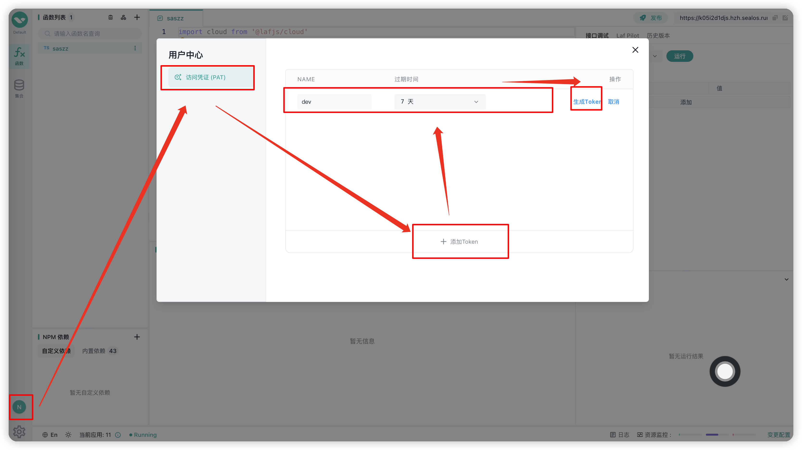
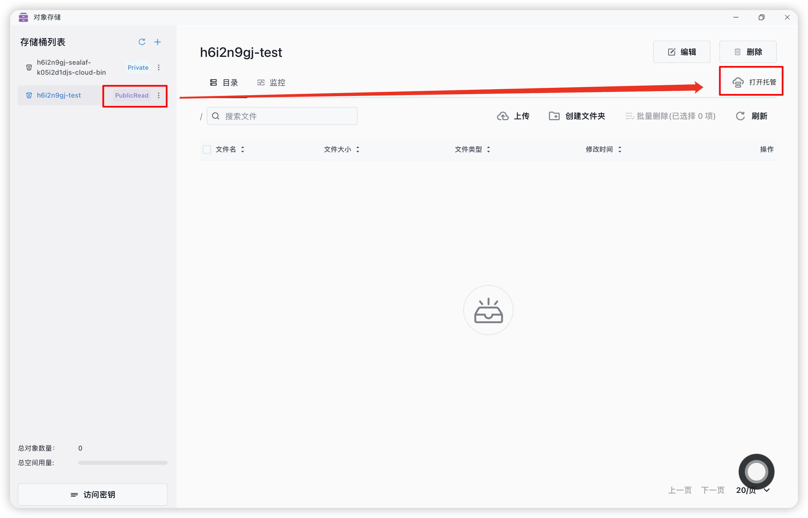

# Laf 迁移到 Sealaf（Sealos 云开发）

## 迁移内容
- 云函数
- 云存储
- 数据库
- 触发器
- 环境变量
- 函数依赖
- 自定义域名
- 网站托管

## 迁移步骤
::: warning
💡 关于 **laf-cli** 的详细使用方法请参考 [laf-cli 文档](../cli/) 
:::

### 1. 分别在 laf 和 sealaf 创建 PAT


---

### 2. 下载 cli 并初始化用户
```bash
npm install -g laf-cli

laf user add laf -r https://laf.run
# 填入对应可用区的 api url
laf user add sealaf-hzh -r https://sealaf-api.hzh.sealos.run 

laf user switch laf
# <PAT> 替换为刚刚创建的 PAT
laf login <PAT>
laf user switch sealaf-hzh
laf login <PAT>
```
---

:::info
Sealos 不同可用区 Sealaf 对应的 api 地址如下：

新加坡：https://sealaf-api.cloud.sealos.io

广州：https://sealaf-api.gzg.sealos.run

杭州：https://sealaf-api.hzh.sealos.run

北京：https://sealaf-api.bja.sealos.run
:::
---

### 3. 拉取原应用数据
```bash
APPID="" # laf 上的 appid
mkdir $APPID && cd $APPID

laf user switch laf
laf app init $APPID

# 拉取云存储、环境变量、依赖
laf func pull

laf env pull

laf dep pull

# 列出存储
laf storage list

# 依次拉取存储到指定目录
laf storage pull <bucketName> <path>

# 拉取数据库
mkdir db
laf database export ./db

# 删除 .app.yaml 以便重新 init 新应用
rm .app.yaml
```
---

### 4. 推送数据到新应用
```bash
NEW_APPID=""
laf user switch sealaf-hzh

laf app init $NEW_APPID

laf func push

laf env push

laf dep push

# 需要先在 sealos 对象存储上手动创建桶
laf storage push <bucketName> <path>

# 导入数据库
laf database import $APPID ./db/xxx.gz

rm .app.yaml
```
---

### 5. **重启应用**
重启以确保环境变量等生效

---

### 6. （可选）手动创建触发器、自定义域名
- 方式一：使用 laf-cli 创建触发器
```bash
# 列出触发器
laf trigger list
# 创建
laf create <name> <target> <cron>
```

- 方式二：在 Sealaf 界面直接创建触发器
---

### 7. （可选）在 sealos 对象存储开启网站托管


---

### 8. （可选）`cloud.storage.bucket` 变更
如果原应用代码中使用了 `cloud.storage.bucket(bucketName)`，需要在新应用中手动修改为新的 bucket 名称（注意：现在必须填完整桶名）