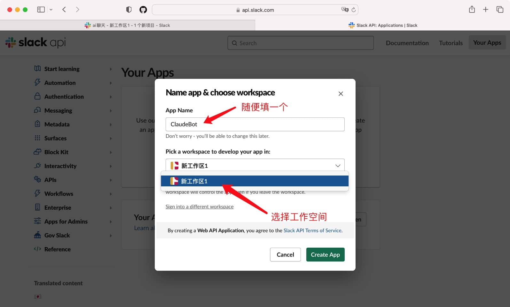
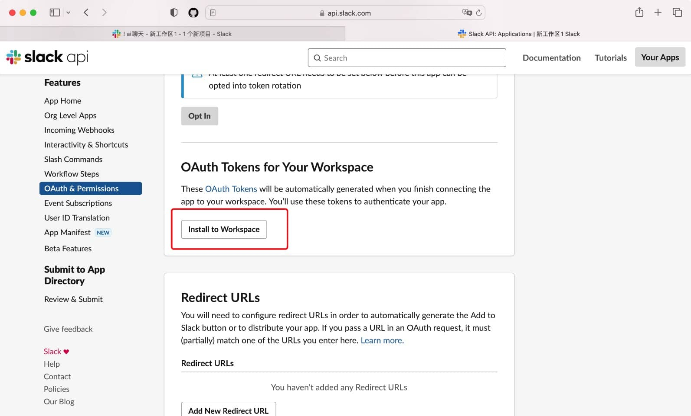

# {{ $frontmatter.title }}

Accessing Claude through Laf is done using the Slack API, so it can be directly called from domestic servers.

## Applying for Claude in Slack

### Registering on Slack and creating a workspace

You need to register using a Google email account.

<https://slack.com/>

### Adding the Claude app to your workspace

This step requires some magic

<https://www.anthropic.com/claude-in-slack>

### Enabling Slack Connect

Slacks registered with a Google account can use a free trial.

After entering the workspace, click on `Slack Connect` on the left side, then click on create channel, and finally click on start free trial. There will be no need to renew later.


### Initiating a conversation with Claude to enable its features

Click on Claude in the app and send any text. A popup will appear with an agree button. Once you click on it, the feature will be enabled and Claude will be able to answer questions. This indicates success!

### Inviting Claude to a channel

In the channel where you want to invite Claude, type `@Claude`. You will be prompted if you want to invite Claude to the channel.

## Configuring the Slack bot

- 1. Login to Slack, <https://app.slack.com/>
- 2. Go to <https://api.slack.com/>
- 3. Create an app. After clicking on `Your Apps` in the upper right corner, create a new app.




- 4. Configure Scopes. Click on OAuth & Permissions in the left sidebar, find User Token Scopes under the Scopes module, click on Add an OAuth Scopes button, and then add the following permissions one by one:

```js
channels:history
channels:read
channels:write
groups:history
groups:read
groups:write
chat:write
im:history
im:write
mpim:history
mpim:write
```

- 5. Install the bot to your workspace by clicking on Install to Workspace under OAuth Tokens for Your Workspace.



## Installing dependencies

`claude-api-slack`

## Cloud Function Invocation

```typescript
import cloud from '@lafjs/cloud'

export default async function (ctx: FunctionContext) {
    const { question, conversationId } = ctx.query
    return await askClaudeAPI(question, conversationId)
}

async function askClaudeAPI(question, conversationId) {
    const token = '' // bot token
    const bot = '' // bot id
    const ChannelName = "" // channel name

    // Initialize claude
    const { Authenticator } = await import('claude-api-slack')

    // Save the client instance in cache to maintain context
    let claudeClient = cloud.shared.get('claudeClient')
    if (!claudeClient) {
        claudeClient = new Authenticator(token, bot)
        cloud.shared.set('claudeClient', claudeClient)
    }
    // Create a channel and get the room ID: channel
    const channel = await claudeClient.newChannel(ChannelName)

    let result
    if (conversationId) {
        result = await claudeClient.sendMessage({
            text: question,
            channel,
            conversationId,
            onMessage: (originalMessage) => {
                console.log("loading", originalMessage)
            }
        })
    } else {
        result = await claudeClient.sendMessage({
            text: question,
            channel,
            onMessage: (originalMessage) => {
                // console.log("loading", originalMessage)
                console.log("loading", originalMessage)
            }
        })
    }
    console.log("success", result)
    return {
        code: 0,
        msg: result.text,
        conversationId: result.conversationId
    }
}
```

> Note: The API instance needs to be saved to cache in order to maintain context.