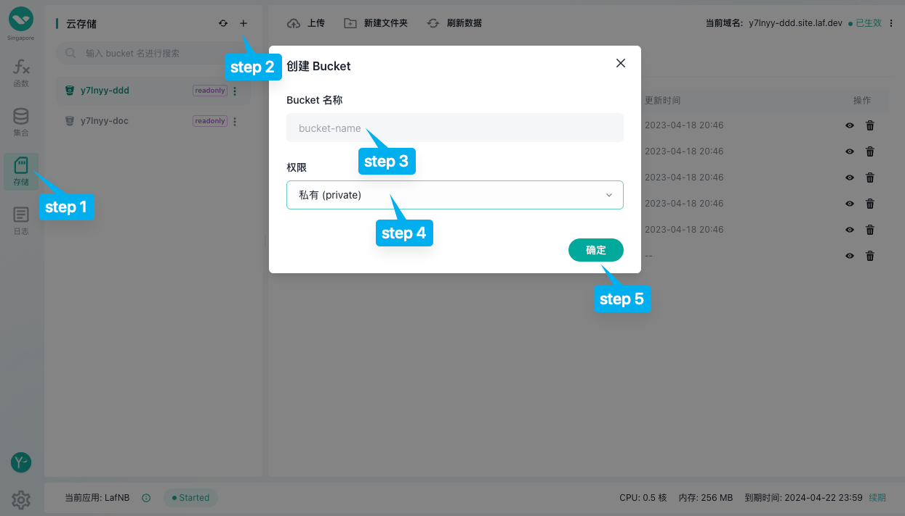

# {{ $frontmatter.title }}

`laf` cloud storage is an object storage service based on [MinIO](https://min.io/), providing full support for MinIO object storage service. It also adheres to the standard s3 interface, allowing us to control file operations in the cloud storage through the s3 API.

## Creating a Bucket

Step 1. Switch to the storage page.

Step 2. Click on the plus sign.

Step 3. Set the bucket name, which consists of `lowercase letters`, `numbers`, and `-`.

Step 4. Set the read and write permissions.

Step 5. Click OK to create successfully.

## Uploading Files via Web Console

Step 1. Click on the upload button.

Step 2. Select the files or folders to upload. Upload them separately for files and folders.

## Obtaining File Access URLs via Web Console

Click on the eye icon next to the file. If the file has readable properties enabled, it means you have obtained the access/download URL for the file.

If the file has non-readable properties enabled, clicking on the eye icon will generate a temporary access link.

## Deleting Files in Web Console

To delete a file, simply click on the trash bin symbol. However, please note that currently, it is not possible to delete multiple files simultaneously in the web console.