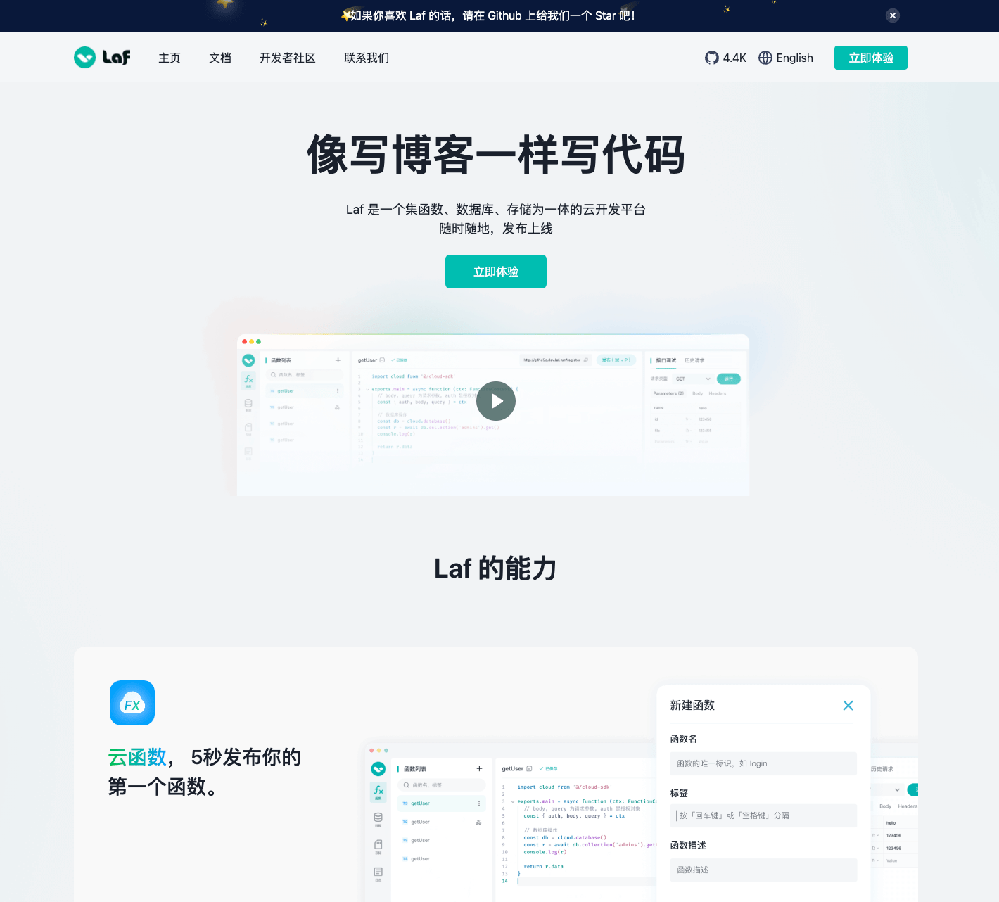
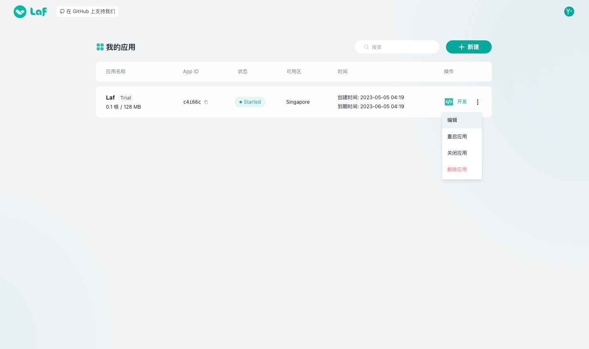

# {{ $frontmatter.title }}

Laf provides developers with a very useful Web IDE, where you can write code online, have perfect type prompts and code auto-completion. It allows you to write functions like writing a blog and easily deploy them online!

## Account Registration

Server Availability

- China Server: [laf.run](https://laf.run)

- Singapore Server: [laf.dev](https://laf.dev)

::: tip
laf.run is a registered domain, while laf.dev is an unregistered domain.

laf.dev can directly connect to the OpenAI API. Please choose the server according to your actual business needs.

Data on China servers and Singapore servers are independent of each other.
:::

Click on the "Try Now" button on the homepage.

Enter your phone number to register and log in.

::: tip
If you want to log in with a password, you can set a new password by clicking on "Forgot Password" after successful registration.
:::

## Create New Application

After logging in, you will enter the Laf Web IDE console.

Here, you can create new applications and manage existing ones.

Choose different application specifications and create Laf applications.

::: tip
Each account can only create one free application. Please note that free applications may stop running periodically and need to be manually restarted.

Free applications require monthly renewal in order to continue using them!

Free applications have lower performance. If you need to use them for formal commercial purposes, please upgrade to a paid specification.
:::

## Application Management

The Laf application list displays the application name, application App ID, application running status, server location, expiration date, and options for developing code and managing the application.

## Application Development

Click the "Develop" button in the application list to enter Laf application development IDE.

The Web IDE is divided into three parts:

  ① Sidebar: It includes cloud functions, collections (database management), storage, logs, user settings, and application settings.

  ② Middle Area: After switching between different features, the displayed content will vary. The image shows the function list of cloud functions, code editor, debugging and documentation, NPM dependency management, console (debug logs), and running results (debugging results).

  ③ Status Bar: It displays the name of the current application, running status, and expiration time.

Laf's Web IDE is very simple and allows you to edit cloud functions, operate databases, and manage cloud storage online. You can use a browser anytime, anywhere to edit and publish code.