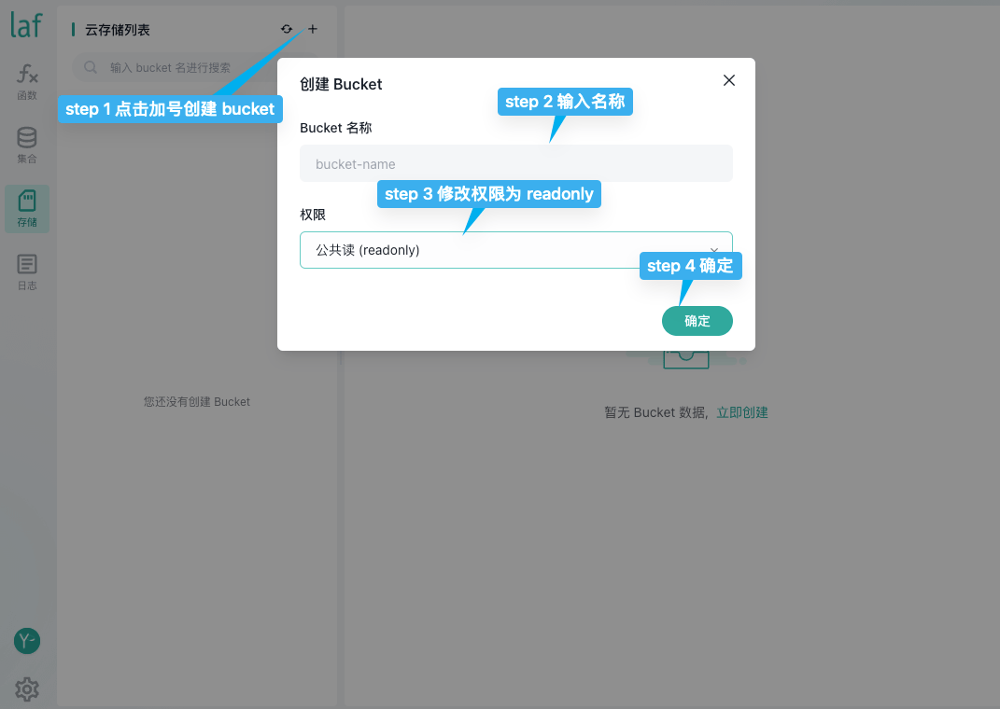

# {{ $frontmatter.title }}

## Introduction

Static hosting is a website hosting service based on cloud storage. 

You can upload your web static files to the bucket in cloud storage through the "Development Console" or `laf-cli`. 

Static hosting will automatically provide a unique domain name for your website, and you can also bind a custom domain name.

## How to use?

- Package your developed project.
- Create a bucket and put the packaged project into it.
- Click on hosting, and the deployment will be successful!

## Bind your own domain name

Laf static website hosting supports binding your own domain name and automatically generates an `SSL` certificate, compatible with both `https` and `http` access.

@see [Steps to bind your own domain name](#Deployment-Successful)

## Demo

### Create a bucket



### Upload files and enable website hosting

Upload the compiled files of the front-end project to the newly created cloud storage.

::: tip
Most of the compiled code for front-end projects is in the `dist` folder. Uploading the `dist` folder will upload all the files in the folder to the cloud storage.
:::


### Deployment Successful

Now we have successfully deployed the website. Click on the link to access it, or we can click on the custom domain name to bind our own domain.

::: tip
After binding your own domain name, Laf will automatically configure an `SSL` certificate for your domain name. This process may take 30 seconds to 2 minutes. After that, you can access it via `https`.
:::


## Automatic Frontend Compilation and Deployment

You can use `Github Actions` to automatically compile the frontend and push it to Laf Cloud Storage.

<!-- /guide/cli/#login -->

1. In the main branch of your frontend project, create an Actions workflow. Here is a basic template:

   This template triggers the Actions automatically whenever new code is pushed to the main branch.

   - `API_URL` is the API address of your current Laf application, such as `laf.dev` corresponds to `https://api.laf.dev`, `laf.run` corresponds to `https://api.laf.run`.

   - `WEB_PATH` is the path of your frontend in the current project. If the frontend project is in the root directory, no modification is needed. If it is under the `web` directory, change it to `'web'`.

   - `DIST_PATH` is the name of the compiled directory. Most projects have a directory named `dist` after compilation.

```yaml
name: Build
on:
  push:
    branches:
      - "*"

env:
  BUCKET_NAME: ${{ secrets.DOC_BUCKET_NAME }}
  LAF_APPID: ${{ secrets.LAF_APPID }}
  LAF_PAT: ${{ secrets.LAF_PAT }}
  API_URL: "https://api.laf.dev"
  WEB_PATH: .
  DIST_PATH: "dist"
jobs:
  build:
    runs-on: ubuntu-latest
    steps:
      - uses: actions/checkout@v3
      - name: Setup Node.js
        uses: actions/setup-node@v3
        with:
          node-version: "16.x"
      # Install project dependencies
      - name: Install Dependencies
        working-directory: ${{ env.WEB_PATH }}
        run: npm install
      # Build the project
      - name: Build
        working-directory: ${{ env.WEB_PATH }}
        run: npm run build
      # Install laf-cli
      - name: Install Laf-CLI
        run: npm i laf-cli -g
      # Login to laf api
      - name: Login laf-cli
        working-directory: ${{ env.WEB_PATH }}
        run: laf login -r ${{ env.API_URL }} $LAF_PAT
      # Initialize the Laf application and push the compiled code to cloud storage
      - name: Init appid and push
        working-directory: ${{ env.WEB_PATH }}
        env:
          LAF_APPID: ${{ env.LAF_APPID }}
        run: |
          laf app init ${{ env.LAF_APPID }}
          laf storage push -f ${{ env.BUCKET_NAME }} ${{ env.DIST_PATH }}/
```

2. Configure some environment variables:

   - `DOC_BUCKET_NAME` is the name of the bucket where your frontend is hosted.

   - `LAF_APPID` is the appid of your Laf application.

   - `LAF_PAT` is the PAT (Personal Access Token) of your Laf application. You can refer to [Obtaining PAT](/guide/cli/#login) for the method to obtain it.

   Set these three parameters as secrets in your project.

   

   Step 1: Click on `Settings`.

   

   Step 2: Click on `Actions` under `Secrets and variables`.

   Step 3: Add `DOC_BUCKET_NAME`, `LAF_APPID`, and `LAF_PAT` one by one.