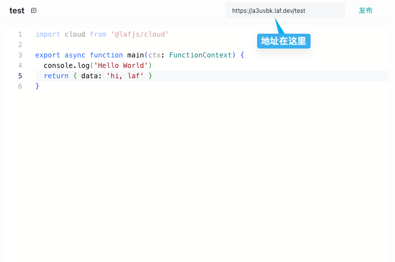

# HTTP 调用

云函数每个云函数都提供了 API 地址，理论上我们可以在任何能发起 http 请求的地方调用云函数。



## `axios` 调用

下面是用前端使用 `axios` 请求云函数的简单示例。

```typescript
// get 请求
import axios from 'axios';

const { data } = await axios({
  url: "<FunctionURL>",
  method: "get",
});

console.log(data);
```

```typescript
// post 请求
import axios from 'axios';

const { data } = await axios({
  url: "<FunctionURL>",
  method: "post",
  data: {
    name: 'Jack'
  }
});

console.log(data);
```

## `curl` 调用

当然也可以使用 `curl` 去调用云函数

GET 请求

```shell
curl <FunctionURL>?query=hello&limit=10 \
     -H "Authorization: Bearer abc123" \
     -H "Content-Type: application/json"
```

POST 请求

```shell
curl -X POST <FunctionURL> \
     -H "Content-Type: application/json" \
     -d '{"name": "John", "age": 30}'
```
