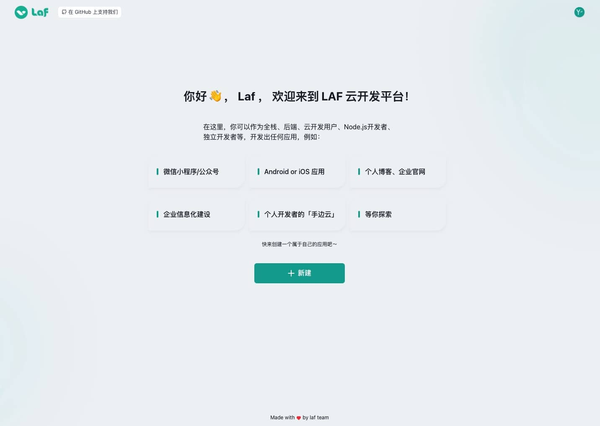
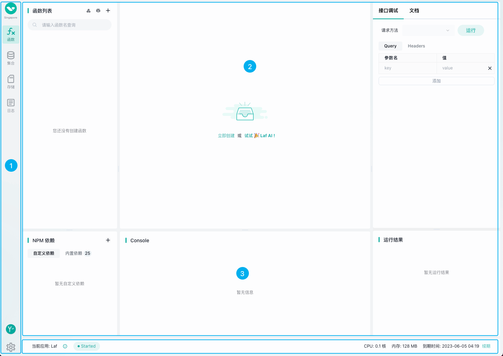

# {{ $frontmatter.title }}

Laf 为开发者提供了非常好用的 Web IDE，在线写代码，完善的类型提示、代码自动完成，像写博客一样写函数，随手发布上线！

## 账号注册

服务器可用区

- 国内服务器：    [laf.run](https://laf.run)

- 新加坡服务器：[laf.dev](https://laf.dev)

::: tip
laf.run 为备案域名，laf.dev 为未备案域名。

因此小程序业务请使用 laf.run。

laf.dev 可直连 OpenAI API，请按照实际业务需求选择服务器

国内服务器和新加坡服务器数据互相独立哦～
:::

点击首页「立即体验」按钮

输入手机号即可注册和登录

::: tip
如果想使用密码登录，可在注册成功后，找回密码来设置新的密码哦～
:::

## 新建应用

登录账号后，会进入 Laf Web IDE 控制台

在这里可以新建应用，以及管理应用

选择不同的应用规格，然后创建 Laf 应用

## 应用管理

Laf 应用列表会显示应用名称、应用 App ID、应用运行状态、应用所在服务器、到期时间、以及开发代码和应用操作等

## 应用开发

在应用列表点击「开发」按钮即可进入 Laf 应用开发 IDE

Web IDE 分为 3 个部分

  ① 侧边栏：分别是云函数、集合（数据库管理）、存储、日志、用户设置、应用设置

  ② 中间区：在切换不同的功能后，显示的内容不同。如图为云函数的函数列表、代码编辑器、调试和文档、NPM 依赖管理、Console（调试日志）、运行结果（调试结果）

  ③ 状态栏：应用状态栏，显示当前应用的名称、运行状态、到期时间

Laf 的 Web IDE 相当简洁，可以在线编辑云函数，操作数据库，以及管理云存储。随时随地可用浏览器去编辑和发布代码。
